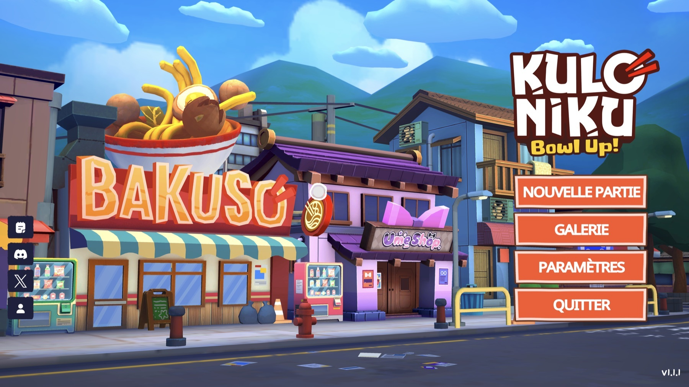
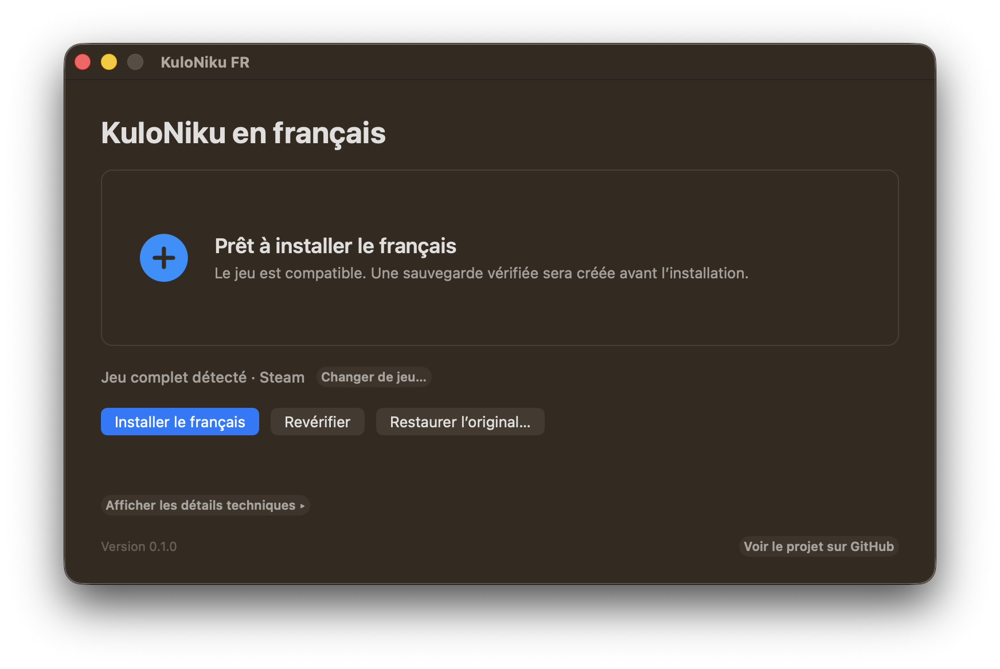
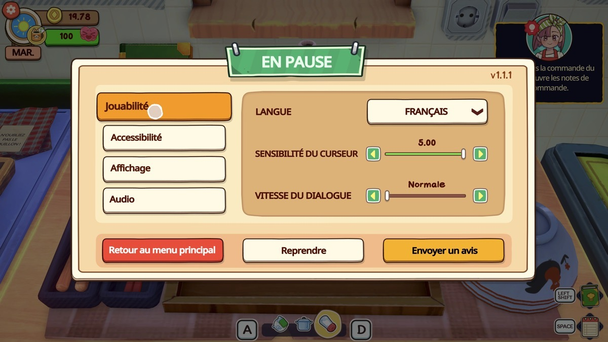
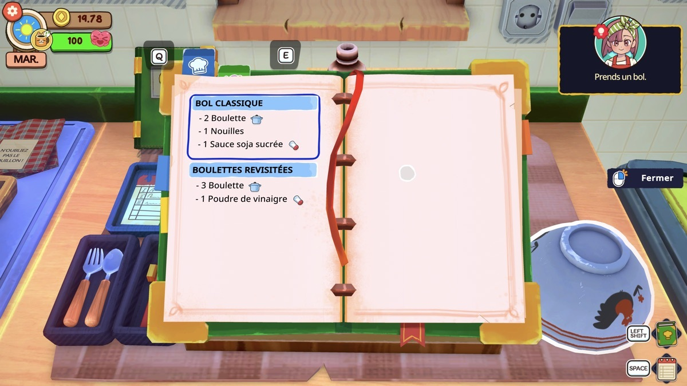

# KuloNiku FR

**Community French patch for _KuloNiku: Bowl Up!_**

[View KuloNiku: Bowl Up! on Steam](https://store.steampowered.com/app/3357960/KuloNiku_Bowl_Up/)
· [Version française](README.md)

KuloNiku FR brings French to both the demo and the full game. It is free,
unofficial, and does not contain any complete game file.

## Project status

- **macOS:** the stable release is available and tested on Apple Silicon and Intel;
- **Windows:** the stable release has been successfully tested with the stable full
  game and its current beta branch (August 20, 2026);
- **game:** full version `1.1.1` tested on macOS and Windows, demo `0.10.5`
  tested on macOS;
- **updates:** unknown new strings remain in English.

---

## Install the patch

Go to the
[official releases page](https://github.com/BertrandVillien/KuloNiku-FR/releases).
Each release note explains which file to download and how to open it.

On Windows, download the **Windows x64** archive, extract it completely, then
open **Installer KuloNiku FR.exe**. The application finds Steam and guides you
through installation, updates, and restoration. The executable is not digitally
signed yet, so Windows SmartScreen may ask for confirmation. Never disable your
antivirus to open it.

On macOS, download the DMG that matches your Mac, then drag **KuloNiku FR** into
**Applications**. The application provides the same operations.

After installation, launch the game from Steam and select **Français** in the
settings.

Want to inspect or modify the code? See the
[source installation guide](docs/INSTALL_FROM_SOURCE.en.md).

### What if macOS blocks the first launch?

Try to open the application once, then go to **System Settings > Privacy &
Security > Open Anyway**. You do not need to disable a Mac security feature or
use the Terminal.

[See Apple’s official instructions](https://support.apple.com/en-gb/102445)

## Easy to undo

Before modifying the game, the application runs a simulation and creates a
verified backup. The **Restore** action returns the original file.

The patch is rebuilt from your own installation: no complete game file is
downloaded or distributed.

[Read the security details](SECURITY.md) ·
[Understand the technical design](docs/DISTRIBUTION.md)

---

## An adaptation, not a word-for-word translation

Each line is compared with the languages shipped with the game, then adapted to
its context and the available screen space. Particular care is given to
Indonesian dishes and character voices. All translations have been reviewed;
some length overages still need visual in-game checks.

  
  

## Contribute

You do not need to know how to code. You can:

- [suggest a French correction](https://github.com/BertrandVillien/KuloNiku-FR/issues/new?template=translation.yml);
- [report an installation issue](https://github.com/BertrandVillien/KuloNiku-FR/issues/new?template=installation.yml);
- attach a screenshot to show the context or an overflowing string.

Never attach a game file or a complete extraction. To contribute with Git,
Codex, Claude, or another agent, see the [contribution guide](CONTRIBUTING.md).

## Why this project?

I wanted to discover KuloNiku, but the number of English ingredients, recipes,
and culinary terms was a real barrier to enjoying it. I first looked for a
careful way to translate the demo. The result convinced me to buy the full game
instead of giving up. It also shows how localization can help new players
discover and support a game.

I built this project with Codex around one simple rule: every change should be
understandable, verifiable, and reversible. The patch is not a raw machine
translation. Each line was reviewed against the languages shipped with the game,
its available screen space, and, whenever possible, its scene context.

Indonesian was especially valuable for respecting the studio’s roots, its food,
and the intent of certain dialogues. The French wording aims to feel natural and
fit the interface.

## Documentation

The [project documentation](docs/README.md) brings together the FAQ,
compatibility notes, translation quality, and technical information.

---

## Unofficial project

_KuloNiku: Bowl Up!_, its text, artwork, and trademarks belong to their rights
holders, including Gambir Studio and Raw Fury. This project is neither affiliated
with nor endorsed by them. It will be removed or archived upon request or if an
official French localization is released.

## Other community translations

Other communities provide their own KuloNiku translations:

- [unofficial Korean patch](https://github.com/killterm/Localization-KuloNikuBowlUp);
- [Japanese translation tool](https://steamcommunity.com/app/3357960/discussions/0/807974496347632869/);
- [AI-assisted Russian translation](https://boosty.to/ketsuneko/posts/5acd1b69-3ade-4a08-9319-95373059a4a6), available under its author’s terms.

KuloNiku FR was created independently and did not use any file or translation
from these projects. These links are provided to help players find the community
for their language.
