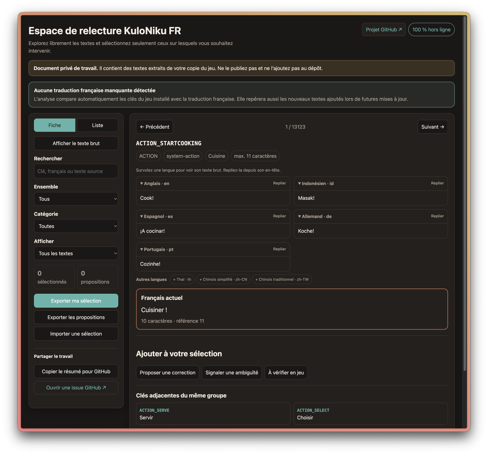

# KuloNiku FR

**Mod de traduction français communautaire pour _KuloNiku: Bowl Up!_**

[Voir KuloNiku: Bowl Up! sur Steam](https://store.steampowered.com/app/3357960/KuloNiku_Bowl_Up/)
· [README English version](README.en.md)

KuloNiku FR permet de jouer en français à la démo et au jeu complet. Le projet
est gratuit, non officiel et ne contient aucun fichier complet du jeu.

## État du projet

- **macOS :** version stable disponible et testée sur Apple Silicon et Intel ;
- **Windows :** version stable testée avec succès sur le jeu complet stable et sur
  la branche bêta actuelle du jeu (20 août 2026) ;
- **Steam Deck :** AppImage native testée sur le matériel réel avec la démo et
  le jeu complet ;
- **jeu :** version complète `1.1.1` testée sur macOS, Windows et Steam Deck ;
  démo `0.10.5` testée sur macOS et Steam Deck ;
- **mises à jour :** les nouvelles phrases inconnues restent en anglais.

---

## Installer le patch

Rendez-vous sur la page des
[releases officielles](https://github.com/BertrandVillien/KuloNiku-FR/releases).
La note de chaque version indique clairement quel fichier télécharger et comment
l’ouvrir.

Sur Windows, téléchargez l’archive **Windows x64**, décompressez-la entièrement,
puis ouvrez **Installer KuloNiku FR.exe**. L’application détecte Steam et vous
guide pour installer, mettre à jour ou restaurer le patch. L’exécutable n’est
pas encore signé numériquement : Windows SmartScreen peut demander une
confirmation. Ne désactivez jamais votre antivirus pour l’ouvrir.

Sur macOS, téléchargez le DMG universel, puis glissez **KuloNiku FR** dans
**Applications**. La même application fonctionne sur les Mac Apple Silicon et
Intel et propose les mêmes opérations.

Sur Steam Deck, l’AppImage native s’utilise en mode Bureau, sans Terminal ni
installation système. Elle détecte le jeu sur le stockage interne ou la carte
microSD. L’installation, la restauration et la réinstallation ont été validées
sur un véritable Deck avec la démo et le jeu complet. Suivez le
[guide Steam Deck](docs/STEAM_DECK.md).

Après l’installation, lancez le jeu depuis Steam et choisissez **Français** dans
les paramètres.

Vous souhaitez examiner ou modifier le code ? Consultez
[l’installation depuis les sources](docs/INSTALL_FROM_SOURCE.md).

### Et si macOS bloque la première ouverture ?

Essayez d’ouvrir l’application une fois, puis allez dans **Réglages Système >
Confidentialité et sécurité > Ouvrir quand même**. Il n’est pas nécessaire de
désactiver une protection du Mac ni d’utiliser le Terminal.

[Voir la procédure officielle d’Apple](https://support.apple.com/fr-fr/102445)

## Une installation facile à annuler

Avant de modifier le jeu, l’application effectue une simulation et crée une
sauvegarde vérifiée. Le bouton **Restaurer** permet de revenir au fichier
d’origine.

Le patch est reconstruit à partir de votre propre installation : aucun fichier
complet du jeu n’est téléchargé ou distribué.

[Lire les détails de sécurité](SECURITY.md) ·
[Comprendre le fonctionnement technique](docs/DISTRIBUTION.md)

---

## Une adaptation, pas une traduction mot à mot

Chaque ligne est comparée aux langues fournies avec le jeu, puis adaptée au
contexte et à la place disponible à l’écran. Une attention particulière est
portée aux plats indonésiens et aux voix des personnages. Toutes les traductions
sont arbitrées ; certains dépassements de longueur restent à contrôler
visuellement en jeu.

  
  

## Participer

Pas besoin de savoir programmer. L’**espace de relecture local** affiche les
huit langues du jeu, les clés voisines et le français actuel. Il repère aussi
automatiquement les traductions manquantes après une mise à jour du jeu.

Dans l’application Windows ou macOS, sélectionnez le jeu, ouvrez **Options avancées** puis
choisissez **Réviser et corriger les traductions**. L’espace s’ouvre dans votre
navigateur, sans modifier le jeu et sans envoyer ses textes sur Internet.
Les propositions exportées peuvent ensuite être installées temporairement avec
**Importer mon fichier de correction** afin de les contrôler directement en jeu.

[Découvrir l’espace de relecture et suivre le tutoriel](docs/REVIEW_WORKSPACE.md)

Vous pouvez également :

- [transmettre une relecture préparée](https://github.com/BertrandVillien/KuloNiku-FR/issues/new?template=review.yml) ;
- [proposer une correction française](https://github.com/BertrandVillien/KuloNiku-FR/issues/new?template=translation.yml) ;
- [signaler un problème d’installation](https://github.com/BertrandVillien/KuloNiku-FR/issues/new?template=installation.yml) ;
- joindre une capture pour montrer le contexte ou un texte trop long.

Ne joignez jamais un fichier du jeu ou une extraction complète. Pour contribuer
avec Git, Codex, Claude ou un autre agent, consultez le
[guide de contribution](CONTRIBUTING.md).

## Pourquoi ce projet ?

Je voulais découvrir KuloNiku, mais la quantité d’ingrédients, de recettes et de
termes culinaires en anglais freinait réellement mon expérience. J’ai commencé
par chercher une manière prudente de traduire la démo. Le résultat m’a convaincu
d’acheter le jeu complet au lieu d’abandonner. Cela montre aussi combien une
localisation peut aider de nouveaux joueurs à découvrir et soutenir un jeu.

J’ai construit ce projet avec Codex en gardant une règle simple : pouvoir
comprendre, vérifier et annuler chaque modification. Le patch ne se contente pas
d’injecter une traduction automatique. Chaque ligne a été reprise avec les
langues fournies par le jeu, sa place à l’écran et, lorsque c’était possible, le
contexte de la scène.

L’indonésien a été particulièrement précieux pour respecter l’origine du studio,
les plats et l’intention de certains dialogues. Les formulations françaises
cherchent à rester naturelles et assez courtes pour l’interface.

## Documentation

La [documentation du projet](docs/README.md) rassemble la FAQ, la compatibilité,
la qualité de la traduction et les informations techniques.

## Soutenir le projet

KuloNiku FR reste entièrement gratuit. Si vous souhaitez soutenir le temps
consacré à ce projet et les activités de mon club informatique, vous pouvez
faire un don libre à l’association Le Moulin Computer Club :
[soutenir mon travail](https://www.helloasso.com/associations/le-moulin-computer-club/formulaires/3).

---

## Projet non officiel

_KuloNiku: Bowl Up!_, ses textes, visuels et marques appartiennent à leurs ayants
droit, notamment Gambir Studio et Raw Fury. Ce projet n’est ni affilié ni
approuvé par eux. Il sera retiré ou archivé à leur demande ou si une traduction
française officielle paraît.

## Autres traductions communautaires

D’autres communautés proposent leur propre traduction de KuloNiku :

- [patch coréen non officiel](https://github.com/killterm/Localization-KuloNikuBowlUp) ;
- [outil de traduction japonaise](https://steamcommunity.com/app/3357960/discussions/0/807974496347632869/) ;
- [traduction russe assistée par IA](https://boosty.to/ketsuneko/posts/5acd1b69-3ade-4a08-9319-95373059a4a6), proposée selon les conditions de son auteur.

KuloNiku FR a été réalisé indépendamment et n’a utilisé aucun fichier ni aucune
traduction provenant de ces projets. Ces liens sont proposés pour aider les
joueurs à trouver la communauté correspondant à leur langue.
