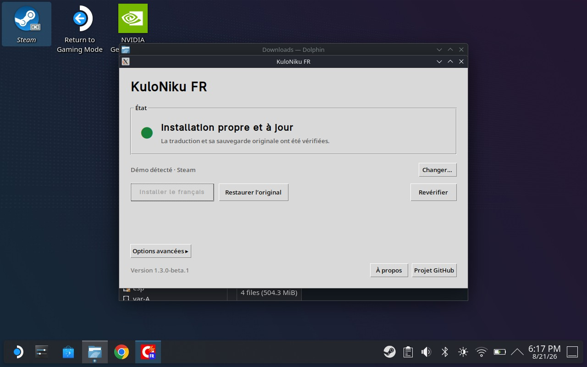

# Install KuloNiku FR on Steam Deck

KuloNiku FR supports both the demo and full game on Steam Deck. Installation is
done in Desktop Mode without a Terminal or any SteamOS modification.

## Download and open the application

1. Install KuloNiku from Steam and launch it once.
2. Select **Steam > Power > Switch to Desktop**.
3. [Download the Steam Deck AppImage](https://github.com/BertrandVillien/KuloNiku-FR/releases/latest/download/KuloNiku-FR-Steam-Deck-x86_64.AppImage).
4. In **Dolphin > Downloads**, right-click the file.
5. Open **Properties > Permissions** and enable **Is executable**.
6. Double-click the AppImage and choose **Launch** if asked.

## Install French

1. Wait for **Prêt à installer le français**.
2. Select **Installer le français** and confirm.
3. After installation, select **Revérifier**. The status should read
   **Installation propre et à jour**.

The application runs a simulation and creates a verified backup before changing
the game.

If the game is not detected, select **Changer…** and choose the game directory
that contains `KuloNiku_Data`.

## Play in French

1. Close the application and select **Return to Gaming Mode**.
2. Launch KuloNiku from Steam.
3. Select **Français** in the language settings.

## Restore the original game

1. Quit the game and return to Desktop Mode.
2. Reopen the AppImage.
3. Select **Restaurer l’original** and confirm.

French can be installed again later with the same AppImage.

## Troubleshooting

- **The AppImage does not open:** confirm that **Is executable** is enabled.
- **The game is not detected:** use **Changer…**.
- **The game no longer starts:** reopen the AppImage and select
  **Restaurer l’original**.

[Frequently asked questions](FAQ.md)
· [Report a problem](https://github.com/BertrandVillien/KuloNiku-FR/issues/new?template=installation.yml)
