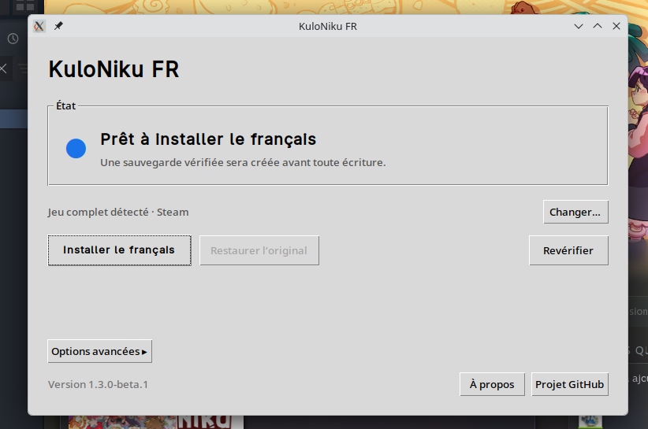

# Installer et tester KuloNiku FR sur Steam Deck

> **Bêta à valider sur un véritable Steam Deck.** L’AppImage actuelle a passé
> les tests automatiques et un essai complet en VM Linux avec Steam et Proton.
> Elle n’est pas encore incluse dans une release stable.

## Télécharger la bêta

Le paquet testé est disponible dans le run GitHub Actions du 20 août 2026 :

- [télécharger l’artefact KuloNiku-FR-Steam-Deck-x86_64](https://github.com/BertrandVillien/KuloNiku-FR/actions/runs/32375908790/artifacts/9409065188) ;
- [consulter le run et ses contrôles](https://github.com/BertrandVillien/KuloNiku-FR/actions/runs/32375908790).

GitHub demande d’être connecté pour télécharger un artefact Actions. Ce lien de
bêta expire le **3 septembre 2026**. Après cette date, utilisez la
[dernière fabrication Steam Deck](https://github.com/BertrandVillien/KuloNiku-FR/actions/workflows/package-steam-deck.yml)
ou demandez une nouvelle fabrication au mainteneur.

Le téléchargement est une archive ZIP. Extrayez-la une seule fois. Elle contient
l’AppImage et son fichier `.sha256`.

- SHA-256 de l’archive ZIP GitHub :
  `f67aa97825007873a7b8a7850ee56974f44ef18e480b52bf912ae8e6bc42a068`
- SHA-256 de `KuloNiku-FR-Steam-Deck-x86_64.AppImage` :
  `53abe0fa1cc87e31ab5c7c1aa11722d4947cca9ce3e595a9b383f1acacc510a7`

La vérification de l’empreinte est facultative pour le parcours sans Terminal.
Un testeur qui souhaite la faire peut ouvrir Konsole dans le dossier extrait et
lancer `sha256sum -c KuloNiku-FR-Steam-Deck-x86_64.AppImage.sha256`.

## Avant d’installer le patch

1. Utilisez le canal **Stable** de SteamOS et installez ses mises à jour.
2. Installez légalement la démo ou le jeu complet depuis Steam, sur le stockage
   interne ou sur une microSD formatée par le Steam Deck.
3. Attendez la fin complète du téléchargement et des mises à jour Proton.
4. Lancez une première fois le jeu **sans le patch**, atteignez le menu principal,
   puis quittez-le normalement. Cette étape permet de distinguer un problème du
   jeu ou de Proton d’un problème du patch.
5. Notez le modèle du Deck (LCD ou OLED), la version de SteamOS, l’édition testée
   (démo ou jeu complet) et l’emplacement du jeu (interne ou microSD).

N’ajoutez aucune option de lancement Steam. En particulier,
`PROTON_USE_WINED3D=1 %command%` était uniquement un contournement graphique pour
la VM VirtualBox et ne doit pas être utilisé sur un Steam Deck.

## Installer le français

1. Appuyez sur **Steam > Marche/Arrêt > Passer en mode Bureau**.
2. Ouvrez Firefox, connectez-vous à GitHub et téléchargez l’artefact indiqué plus
   haut.
3. Dans Dolphin, ouvrez **Téléchargements** et extrayez l’archive ZIP.
4. Faites un clic droit sur l’AppImage extraite, ouvrez **Propriétés >
   Permissions** et cochez **Est exécutable**.
5. Double-cliquez sur l’AppImage. Si Dolphin demande une confirmation, choisissez
   **Lancer**.
6. L’application recherche le jeu et lance automatiquement une simulation. Ne
   cliquez sur rien tant que **Vérification du jeu…** est affiché.
7. Vérifiez que l’écran indique **Jeu complet détecté · Steam** ou
   **Démo détectée · Steam**, puis **Prêt à installer le français**.
8. Cliquez sur **Installer le français** et confirmez. L’application crée et
   vérifie une sauvegarde SHA-256 avant de remplacer le fichier local.
9. Attendez le message de réussite, puis cliquez sur **Revérifier**. L’état doit
   indiquer que l’installation est propre et à jour.

L’application détecte les bibliothèques du stockage interne et de la microSD.
Si elle ne trouve rien, utilisez **Changer…** et choisissez le dossier du jeu qui
contient `KuloNiku_Data`. Ne sélectionnez pas directement `resources.assets`.

## Vérifier dans le jeu

1. Fermez l’AppImage.
2. Revenez en mode Jeu avec **Return to Gaming Mode**.
3. Lancez KuloNiku normalement depuis sa fiche Steam.
4. Dans les paramètres de langue, choisissez **Français**. Le patch réutilise
   l’emplacement interne de l’allemand : voir
   [Sélection de la langue française](LANGUAGE_SELECTION.md).
5. Contrôlez au minimum le menu principal, les paramètres, un tutoriel, une
   recette et un dialogue.
6. Quittez puis relancez le jeu pour vérifier que la langue reste sélectionnée.

Le patch ne reste pas actif en arrière-plan et ne modifie pas Proton. Sur le
matériel réel, il ne doit donc provoquer aucune baisse de performances. Les
fortes lenteurs observées en VM venaient du rendu graphique logiciel de
VirtualBox.

## Tester la restauration et la réinstallation

Ce contrôle est obligatoire pour valider la bêta :

1. Quittez complètement le jeu et repassez en mode Bureau.
2. Rouvrez la même AppImage et attendez sa vérification.
3. Cliquez sur **Restaurer l’original**, puis confirmez. Une simulation de la
   restauration est effectuée avant l’écriture et la sauvegarde est revérifiée.
4. Cliquez sur **Revérifier**. L’application doit de nouveau proposer
   **Installer le français**.
5. Relancez brièvement le jeu et confirmez que l’état d’origine est fonctionnel.
6. Quittez le jeu, rouvrez l’AppImage et réinstallez le français.
7. Relancez enfin le jeu et confirmez que **Français** est de nouveau disponible.

Conservez l’AppImage pendant toute la bêta : elle permet de revérifier, mettre à
jour ou restaurer le patch. Une vérification des fichiers depuis Steam restaure
également les fichiers officiels, mais elle ne remplace pas le test du bouton de
restauration intégré.

## Si quelque chose ne fonctionne pas

- **L’AppImage ne s’ouvre pas :** vérifiez qu’elle a été extraite du ZIP et que
  **Est exécutable** est coché.
- **Le jeu n’est pas détecté :** vérifiez qu’il est entièrement installé, puis
  utilisez **Changer…** pour sélectionner le dossier contenant
  `KuloNiku_Data`.
- **La simulation échoue :** n’insistez pas et ne modifiez aucun fichier à la
  main. Ouvrez **Options avancées > Journal de logs** et joignez une capture du
  message.
- **Le jeu ne démarre plus :** restaurez l’original avec l’AppImage. Indiquez
  aussi si le jeu non patché avait réussi le contrôle préalable.
- **Le lien a expiré :** ne téléchargez pas une copie depuis un site tiers ;
  demandez une nouvelle fabrication GitHub Actions.

N’utilisez pas `sudo`, `pacman`, Protontricks ou Wine et ne désactivez pas le
mode lecture seule de SteamOS. L’AppImage ne demande aucune installation système.

## Compte rendu attendu

Le rapport doit préciser :

- Steam Deck LCD ou OLED, version de SteamOS et canal utilisé ;
- jeu complet ou démo, stockage interne ou microSD ;
- détection automatique ou sélection avec **Changer…** ;
- résultat de l’installation, du test en jeu, de la restauration et de la
  réinstallation ;
- éventuels textes trop longs, restés en anglais ou incorrects, avec captures.

Ne joignez jamais `resources.assets`, un autre fichier du jeu, une sauvegarde du
patch, un rapport de crash contenant des données personnelles ou vos
identifiants Steam.

[Signaler un problème Steam Deck](https://github.com/BertrandVillien/KuloNiku-FR/issues/new?template=installation.yml)
· [FAQ officielle du mode Bureau Steam Deck](https://help.steampowered.com/en/faqs/view/671A-4453-E8D2-323C)
· [Informations officielles sur SteamOS et Proton](https://www.steamdeck.com/fr/software)
· [Télécharger un artefact GitHub Actions](https://docs.github.com/fr/actions/how-tos/manage-workflow-runs/download-workflow-artifacts)
